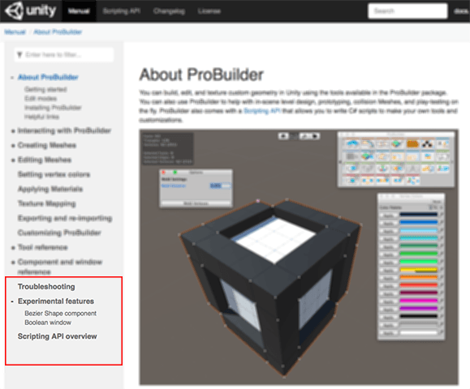

> **_Package Documentation Review Template_**
>
> Use this template to bundle up documentation for technical review. You can download this package and save it locally, follow the instructions for setting up a local package and regenerate the documentation with the DocTools package. See [Package documentation with Git](https://docs.google.com/document/d/15sUDWM6cFnDYobQBxuqn7qo5mAfIJHEPmu4Oe0Kb7xs/edit#heading=h.5pzo4lmokc4t) for details.
>
> To create your parcel:
>
> 1. Follow the instructions in blockquotes.
>
> 2. Replace angle brackets with the appropriate text. For example, replace `<PACKAGE-NAME>` with the official name of the package.
>
> 3. Delete sections that do not apply to your parcel. For example, you might not use a GitLab fork for your documentation, so you can delete all references to it.
>
> 4. Open up your MD files and copy and paste the contents into the sections below. If you are including subsections, you can replace all instances of `\n#` with `\n##` to demote every heading by one (but don't forget to check the first heading in the file too).
>
> 5. Copy all images into the `images` subfolder. Provided your original package also uses the `images` subfolder to store screen captures and graphics, copying is all you need to do to make them appear seamlessly.
>
> 6. After documentation is completed, make sure you delete all instructions and examples in blockquotes including this preamble and its title.
>
> 7. After you have regenerated the documentation locally, the `packages` folder appears. This is where DocFx dumps the output. Just copy the entire output folder from your local package (eg., on Mac: `<user>/Library/Application Support/Unity/Editor/documentation/packages/com.unity.my-local-package@0.1`) and then replace the topmost index.html with a page that redirects to `manual/index.html`.
>
> 8. Either send the zip by email or upload it to your Google Drive and then share it on Slack or email along with the announcement that there is some doc to review. I also provided a picture of the Table Of Contents for reference.
>
> 9. Let me know if you have any questions or issues with using this template or process. Likewise, if you want me to add more explanation in the instructions or the README.md file, let me know.

# &lt;PACKAGE-NAME&gt; Docs Review Parcel #1

The following pieces of documentation are ready for review:

* [One](#one)
* [Two](#two)
  * [Two and a Half](#two-and-a-half)
  * [Two and Three Quarters](#two-and-three-quarters)
* [Three](#three)

This excerpt fits into the overall Table Of Contents like so:

These three sections are not directly related, they are just packaged together for convenience. 

> ***Note:*** Many of the links do not work in this version because it is a small  subsection of the entire documentation set. However, don't hesitate to tell me if there are any links you would expect to work that don't (that is, any links that point to the main Unity manual or a topic that is in this package).

## Guidelines for reviewers

> ***TL;DR:*** If you skip most of this preamble, please read the Section-specific notes where I explain why I changed some docs and where I got my info. I have a GitLab fork where I have been making updates, so if you want to skip writing comments in Google or Slack and update the MD directly, just request access in GitLab.

This is a technical review, so please let me know if anything is incorrect, misleading, or missing from these sections. Ensuring accuracy is 95% of the goal for this review.

If you detect any spelling or grammatical errors, please don't hesitate to let me know. However, this documentation will be copy edited and proofread by an editor in the core documentation team, so don't worry about spelling and style too much.

If you find the text is unclear, please let me know. If you find I have not explained basic concepts thoroughly, please tell me.

I added some explanation of basic concepts because I expect the package version of ProBuilder to have a new and somewhat novice audience. But if you find the descriptions or procedures too simplistic or basic, please let me know as well. 

## General comments and goals

My goal for updating the &lt;PACKAGE-NAME&gt; documentation (in general) includes the following:

* Ensure that users new to &lt;SOMETHING&gt; in general would be able to start using &lt;PACKAGE-NAME&gt; pretty quickly. To do this, I added some extra information for novice users, as well as some basic conceptual descriptions.
* Add some extra detail and depth to the documentation by making sure that every field, button, and control was documented on the reference pages. If there is no information for a setting or control, it can be frustrating for new users.
* Update all documentation (but especially the reference pages) to make sure that new features are documented and screen shots match the version. 
* Bring the documentation in line with Unity standards for documentation. 

## Section-specific notes

> ***Note:*** You don't have to provide information for every section: this is only if you need to ask questions or make a note about something you think might be important for the dev to know.

### The 'One' section

I added THIS AND THAT...

### The 'Two' section

> ***Note:*** Even though this section includes two extra subsections, it is fine to only include a blurb about the

### The 'Three' section

For this section, I updated the documentation for ....

Please review all code samples and overview information to make sure it is accurate.

### Timeframe

This is a small portion of the documentation, relatively speaking, so I would like to receive all comments in 4 business days: &lt;DAY&gt;, &lt;MONTH&gt; &lt;DATE&gt; by end of day (roughly &lt;TIME&gt; &lt;ZONE&gt;). If anyone feels they need more time, please let me know through the **#CHANNEL-NAME** channel or direct message on Slack. I am also happy to receive feedback earlier.

I am working off my own fork of the GitLab project: https://gitlab.internal.unity3d.com/YOUR-FORKED-PACKAGE

At the present time, there is no easy path for reviews of documentation for packages. If you prefer to modify the MD files directly, let me know and I will add you as a collaborator on my fork. Otherwise, I am happy to receive comments by Slack, email, or by Google Doc.

---

# One

> Dump content here

# Two

> Dump content here

## Two and a Half

> Dump content here

## Two and Three Quarters

> Dump content here

# Three

> Dump content here

---
