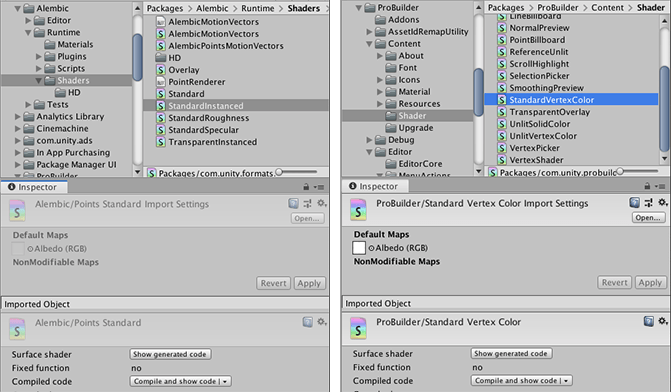

# Packages

Packages are newer, more tightly integrated versions of [Asset packages](AssetPackages), able to deliver a wide range of enhancements to Unity through the Package Manager. In the Editor, you can access the [Packages window](upm-ui) through this menu: **Window** > **Package Manager**. 

A package is a container that stores various types of features or Assets, such as:

* Editor tools and libraries, such as a text editor, an animation viewer or test frameworks.
* Runtime tools and libraries like the Physics API or a Graphics pipeline.
* Asset collections, such as Textures or animations.
* Project templates to share common project types with others.


## How Unity works with packages

When Unity opens a Project, the [Unity Package Manager](upm-parts) reads the [Project manifest](upm-manifestPrj) (**1**) to figure out what packages to load in the Project. Then it sends a request (**2**) to the [registry server](upm-concepts#Registry) (**3**) for each package that appears as a dependency in the manifest. The registry server sends the requested information and data back to the Package Manager (**4**), which then installs those packages (**5**) in the Project. Each Project has its own manifest which lists the packages to load as "dependencies" of the Project.


If you want to include a package in your Project, you must update the [Project manifest](upm-manifestPrj) to include it in the list of dependencies. If you wish, you can modify the Project manifest directly, but it is safer and easier to let the Package Manager do that. For more information on using the user interface, see the documentation for the [Packages window](upm-ui). 


## Getting started

The Package Manager uses three interfaces to communicate with users, manifests, and registries:

* You can use the [Packages window](upm-ui), which is the Package Manager user interface, to quickly browse and search for features. It also allows you to easily select the packages you want to install and update, and resolve conflicts in package dependencies. 
* The Package Manager provides a [dedicated inspector](class-PackageManifestImporter) in Unity, which allows you to walk through the contents of packages and view their manifests. This [Project view integration](upm-inspect) means you can also edit package manifests directly in Unity for [embedded](upm-concepts#Embedded), [Git](upm-concepts#Git), or [local](upm-concepts#Local) packages. 
* The [Package Manager scripting API](upm-api) enables users to interact with the Package Manager programmatically. 

### Where to find out more information about packages

The next step depends on what level of experience you have and what problem you are trying to solve.

If you are only interested in finding documentation for a specific package, see [Finding package documentation](upm-docs). 

For information about using packages with the Unity Package Manager, the following table provides links to various topics of this documentation:

| **User types:**                                              | **See this documentation:**                                  |
| ------------------------------------------------------------ | ------------------------------------------------------------ |
| **Novice** users                                             | [Finding packages](upm-ui-find) explains how to use the **Packages** window to find specific versions of each package.<br /><br />The [Packages window](upm-ui) section explains how to interact with the Unity Package Manager inside Unity. <br /><br />The [Packages documentation](PackagesList) page lists the packages that are currently available for this version of Unity, with links to the documentation for the most recent version published. |
| Users who want to know how to **install** packages           | [Installing from the registry](upm-ui-install) describes how to use the **Packages** window to install a new package from the registry. <br /><br />[Installing a local package](upm-ui-local) describes how to use the **Packages** window to install a package from a local folder.<br /><br />The [Dependencies](upm-dependencies) describes how to edit the Project manifest to install packages from all locations, including two locations that the **Packages** window doesn't support: [Embedded](upm-dependencies#Embedded); and [Git URLs](upm-dependencies#Git).<br /><br />[Switching to another package version](upm-ui-update) describes how to use the **Packages** window to switch versions of a package already installed.<br /><br />[Removing an installed package](upm-ui-remove) describes how to use the **Packages** window to remove a package from your Project.<br /><br />[Disabling a built-in package](upm-ui-disable) describes how to use the **Packages** window to enable and disable built-in packages. |
| Users who are having **problems** with packages in their Project | If any of your Project's packages, including the [Packages window](upm-ui) itself, fails to load correctly, refer to the [Troubleshooting](upm-errors) and [Package conflicts](upm-conflicts) sections. |
| Users who want to learn more about **how packages work**     | The [Project manifest](upm-manifestPrj) reference page describes each attribute, including what values are valid and what role they play.<br /><br />The [Inspecting packages](upm-inspect) reference page describes how to view a package manifest in the Inspector. If the package is mutable (can be edited), you can also use the Inspector to modify the manifest itself. |
| **Advanced** users                                           | To get started creating scripts that interact with the Package Manager, see [Scripting API for packages](upm-api). It provides a high-level overview of working with the Package Manager APIs and code samples for [browsing the list of packages](upm-api#Find) and [adding a package to a Project](upm-api#Install).<br /><br />If you want to find out about how to use your own package registry server in addition to the standard Unity registry, see [Scoped package registries](upm-scoped). |
| Package or feature developers who want to **build** and share tools or Assets in a **package** | The [Custom packages](CustomPackages) section is a complete guide on building your own packages. It explains custom package requirements, such as naming and file structure. It also covers how to fill out the package manifest, share your package, and more. |


### Concepts

This section explains many of the concepts surrounding the Unity Package Manager functionality:

* [Versions](#Versions)
* [Manifests](#Manifests)
* [Registry](#Registry)
* [Package Management](#Management)
* [Package states](#States)
* [Package sources](#Sources)


#### Versions

Multiple versions of each package are available, marking changes to that package along its life cycle. Every time a package developer changes the package contents, they [give it a new version number](upm-manifestPkg#pkg-ver). A change in package version tells you whether it contains a breaking change (major), a new backward-compatible functionality (minor), or bug fixes only (patch). 

To view the list of versions available for a specific package, see [Finding a specific version](upm-ui-list#VersionList).


#### Manifests

There are two types of manifest files: [Project manifests](upm-manifestPrj) (`manifest.json`), which store a list of packages and versions that the Project requires; and [package manifests](upm-manifestPkg) (`package.json`), which store information about the specific package. Both files use [JSON](https://json.org) (JavaScript Object Notation) syntax.


#### Registry

Unity maintains a central registry of official packages that are available for distribution. A [package registry](upm-manifestPkg#registry) stores package sources and information (metadata) on each package version. By default, all Projects use the official Unity package registry, but you can [add additional registries](upm-scoped) to store private packages or stage packages in development. 


#### Package Management

The Unity Package Manager is the central nervous system of the entire package system. It communicates with the Unity registry and any additional registries you specify. It reads your [Project manifest](upm-manifestPrj) and fetches package sources and metadata. It installs, upgrades, and uninstalls packages. It enables and disables Unity's built-in packages. It displays information about every version of every package. It [resolves conflicts](upm-conflicts) when more than one package version is listed as a dependency in the Project manifest.

The Unity Package Manager installs samples, tools, and Assets on a per-Project basis, rather than installing something across all Projects for a specific machine or device. It uses a read-only [global cache](upm-cache) to store downloaded package metadata and contents. Once installed, Unity treats [package Assets](upm-assets) just like any other Asset in the Project, except that these Assets are **immutable** (read-only). You can only change Assets from [Local](#Local), [Embedded](#Embedded), and [Git](#Git) package sources.


#### Package states

States indicate where the package is in the development cycle: 

| **State**                                     | **Description**                                              |
| --------------------------------------------- | ------------------------------------------------------------ |
| **In Development**      | The package developer is still creating the package. Usually this corresponds to having the package embedded in the developer's Project. |
| **Preview**             | The package is ready to use, but not in production. This stage is like a beta cycle. |
| **Production-ready** | The package is safe to use in production and the developer has published it to the package registry. |
| **Verified**           | The package has undergone testing and has been verified to work safely with a specific version of Unity, and all other packages verified for that version. |

The **Packages** window displays a tag that corresponds to some of these states. For more information, see [Tags](upm-ui-details#Tags). 


#### Package sources

Sources describe where the package is available or where the Package Manager installed the package. 

* **Built-in** packages allow you to enable or disable Unity features (for example, Terrain Physics, Animation, etc.). They are immutable (read only).
* Most packages come from a package registry into a [global cache](upm-cache) on your computer as you request them. These are also immutable.
* Packages that are either embedded inside your Project folder, stored locally on your computer, or that you have installed using a Git URL, are mutable. 

##### Registry sources for immutable packages

The Unity Package Manager downloads most packages from a package registry into a [global cache](upm-cache) on your computer as you request them. These packages are immutable (read only), so you can use them in your Project, but you cannot modify them or change their package manifests. 

In addition, Unity automatically pre-installs a select number of **Default** immutable packages (for example, the Analytics Library, Unity Timeline, etc.) when you create a new Project. 

**Bundled** packages are stored in the [global cache](upm-cache) but not installed in your Project when you install Unity. You can install these packages even if you are completely offline (not currently connected to the internet or a local network).

##### Other sources for mutable packages

You can edit the package contents from these sources, including their package manifests:

| **Source**                          | **Description**                                              |
| ----------------------------------- | ------------------------------------------------------------ |
| **Embedded** | Any package stored inside your Project folder is *embedded* and is mutable. This source corresponds with the *in development* state because you typically put all the scripts, libraries, samples, and other Assets your new package needs in a folder under your Project folder when you begin development on a package. |
| **Local**       | You can [install a package](upm-ui-local) from any folder on your computer. For example, if you cloned a development repository locally. These packages are mutable. |
| **Git**           | The Package Manager installs these mutable packages directly from a Git repository instead of from the registry server. |

To edit the package manifest for a package, see [Inspecting packages](upm-inspect).

The **Packages** window displays a tag that corresponds to some of these sources. For more information, see [Tags](upm-ui-details#Tags).


### Global Cache

When the Unity Package Manager downloads package contents and metadata, it stores them in a global cache. This makes re-using and sharing packages more efficient, and allows you to install and update stored packages even when offline. The global cache is read-only to users and installed with Unity starting with version 2017.4.

#### Location

By default, Unity stores the global cache in a root directory that depends on the operating system (and the user account type on Windows):

| **Operating system**              | **Default root directory**      |
| --------------------------------- | ------------------------------- |
| Windows (non-system user account) | `%LOCALAPPDATA%\Unity\cache`    |
| Windows (system user account)     | `%ALLUSERSPROFILE%\Unity\cache` |
| macOS                             | `$HOME/Library/Unity/cache`     |
| Linux                             | `$HOME/.config/unity3d/cache`   |

#### Structure

The Package Manager uses two different shared caches, each serving a different purpose. They are stored in subdirectories under the folder location above:

| **Subfolder** | **Description**                                              |
| ------------- | ------------------------------------------------------------ |
| `npm`         | Stores data obtained from registries using the [npm](https://www.npmjs.com/package/protocol) protocol. This includes package metadata and package [tarballs](https://en.wikipedia.org/wiki/Tar_(computing)). |
| `packages`    | This cache contains the uncompressed contents of package tarballs fetched from a registry. |

Inside each of these subfolders, each registry has its own path so that packages hosted on different registries are not mixed up.

#### Requirements

The user account running the Unity Editor process must have full write permissions on the root directory and its contents. Without these permissions, the Package Manager cannot download and save the package metadata and payload in the cache.

#### Customizing the shared cache location

You can use two environment variables to override either global cache folder:

* **UPM_NPM_CACHE_PATH** overrides the npm folder path. For example (macOS):

	`UPM_NPM_CACHE_PATH=/dev/ssd/shared/Unity/cache/npm`

* **UPM_CACHE_PATH** overrides the packages folder path. For example (macOS):

	`UPM_CACHE_PATH=/dev/ssd/shared/Unity/cache/packages`

You must restart the Unity Editor or Hub after changing either of these environment variables for them to take effect. 


## Packages window

Use the Unity Package Manager (in Unity’s top menu: **Window** > **Package Manager**) to view which [packages](Packages) are available for installation or already installed in your Project. In addition, you can use this window to see [which versions are available](upm-ui-list#VersionList), and [install](upm-ui-install), [remove](upm-ui-remove), [disable](upm-ui-disable), or [update](upm-ui-update) packages for each Project.


The Packages window displays:

  The **Add package from disk** button, which allows you to [specify the location](upm-ui-local) of an external package.

 The [package scope drop-down menu](upm-ui-filter), which allows you to filter which packages appear in the list.

 The [Advanced button](#Advanced), which allows you to display preview packages in addition to packages that have been verified to work with Unity.

 The [search box](upm-ui-search), which allows you to look for packages by name.

 The [packages list view](upm-ui-list), which displays all packages that match the filter and search parameters you specify.

 The [package-specific detail view](upm-ui-details), which displays information specific to the package selected in the list.

 The [status bar](upm-ui-details#StatusBar), which displays messages about the package load status and warnings about the network.


### Advanced button

The **Advanced** drop-down menu allows you to perform these actions:

| **Drop-down menu item**        | **Action results**                                           |
| ------------------------------ | ------------------------------------------------------------ |
| **Reset Packages to defaults** | Select this item to return to Unity Package Manager default settings.  <br /><br />**WARNING**: This removes all customization from your Project manifest file. Only use this a last resort when you can't figure out what is wrong with your Project manifest file. |
| **Show dependencies**          | Display each package's dependencies in the details view.     |
| **Show preview packages**      | Include preview packages in the package list.  <br /><br />**NOTE**: Preview packages are not verified to work with Unity and might be unstable. They are not supported in production environments. |


### List view

The **Packages** window displays the list of packages according to the criteria that you select by filtering, including, or searching:

 

 You can click these expander icons to show and hide the list of versions available for this package.

 The package version displays the version of the package that's installed. If the package is not yet installed, the version that appears is the recommended version.

 These icons show you the status of the package:

| **Icon:**                                                    | **Description**                                              |
| ------------------------------------------------------------ | ------------------------------------------------------------ |
|  | A check mark indicates that the package is already [installed](upm-ui-install) or [enabled](upm-ui-disable). |
|  | The download icon indicates that the installed packages have an [available update](upm-ui-update). |
|  | An error icon indicates that something went wrong during installation or loading. For more advice on resolving errors, see [Error messages](upm-errors). |

By default, the **Packages** window displays the list of **All packages** with no [Preview](upm-concepts#Preview) packages, but you can [filter](upm-ui-filter) the list to display only packages installed in your Project (including [local](upm-local) packages) or display only [built-in](upm-concepts#BuiltIn) Unity packages. You can also [include Preview packages](#ShowPreview) in the list and [search](upm-ui-search) for a specific package by package [name](upm-manifestPrj#name), [tag](upm-ui-details#Tags) name, or package [version number](upm-concepts#Version).


#### Including Preview packages

[Preview](upm-concepts#Preview) packages do not appear by default in the list of packages on the **Packages** window. This is because preview packages may be unstable and should not be used in production. 

To include preview packages in the list, select **Show preview packages** from the [Advanced](upm-ui#Advanced) drop-down menu.

  


#### Finding a specific version

To view the list of versions available for a package: 

1. In the list of packages, click the expander icon to the left of the package name.

	 

	If there are updates available, they are displayed along with the **See all versions** link. 

2. Click **See all versions** to see the list of all available versions for that package.

	 

3. You can select any of these versions for the current package and see the details specific to that version in the [Details view](upm-ui-details).


### Details view

The pane on the right side of the Packages window displays details about the selected package.

 


These details include the following information:

 The display name.

 The [version number](upm-ui-list#VersionList) (and [tag](upm-ui-details#Tags), if available)

 The links to [open the package documentation](upm-docs) page, the package change log (if available), and the license information. 

 The official package name from the [registry](upm-concepts#Registry). Unity packages always start with "**com.unity.**".

 The author.

 A brief description.

Dependency information. This section lists whether this package depends on another package and which version. Installed packages indicate the status of the dependencies after the version number. Packages without dependencies display the message "No dependencies".  

 Packages that include sample Assets display the samples along with an import button. To import the sample code, click the **Import in project** button next to the sample.

 Button to [install](upm-ui-install) or [update](upm-ui-update) a package (or the **Up to date** message if the selected version is already installed.)

 Buttons to [remove](upm-ui-remove) or [disable](upm-ui-disable) the package.


#### Status bar

The Package Manager displays messages in the status bar at the bottom left of the Packages window.

There are typically three status messages that you might see. The **Loading packages** message appears briefly the first time you open Packman UI in a new Project. However, if the Package Manager [detects a problem](upm-errors), such as a missing network connection, the Package Manager displays a warning in the status bar:

 

You will also often see a message informing you when the last update occurred:

 


#### Tags

Some packages display tags next to the version number. These tags convey information about the source or state of the package:

* [Source](upm-concepts#Sources) tag types indicate where the package originates from. For example, whether it comes from a local repository or is downloaded from the package registry.
* [State](upm-concepts#States) tag types indicate at the package's stage of the development cycle. For example, whether it is in development, preview, or verified for a specific version of Unity.

Some source tags imply state tags and vice versa. For example, if a package is embedded in your Project, then it is automatically assumed to be in development, so only the **in development** tag appears in the details view.

The **Packages** window displays the following values:

| **Tag**                            | **Type** | **Meaning**                                                  |
| ---------------------------------- | -------- | ------------------------------------------------------------ |
| [Verified](upm-concepts#Verified)      | state    | This package has been verified by Unity's Quality Assurance team to work with a specific version of the Editor. |
| [Preview](upm-concepts#Preview)        | state    | This package is at an early stage of the release cycle and may not have been documented and fully validated by either the development team or Unity's Quality Assurance team. |
| [In Development](upm-concepts#Develop) | state    | This package is in a very early stage of development and is [embedded](upm-concepts#Embedded) in your Project. |
| [Local](upm-concepts#Local)            | source   | This package is located on your local disk but is external to your Unity Project folder. |

**NOTE**: If no tag appears beside the package version in the details view, it is [production quality](upm-concepts#Production), which means it is fully validated, documented, supported, and incrementally updated.


### Finding packages

To find a specific package version:

1. In Unity, open the **Packages** window (navigate to Unity’s main menu and go to **Window** > **Package Manager**). 

2. If you are looking for a [preview package](upm-concepts#Preview), select **Show preview packages** from the [Advanced](upm-ui#Advanced) drop-down menu. 

	 

3. Select the package you want information for from the packages [List view](upm-ui-list) (on the left). 

4. Expand the arrow to the left of the package in the list. 

	A new row appears, displaying the **See all versions** link. 

	 

5. Click the **See all versions** link. 

	A scrollable list appears with all available versions.

	 

6. Click on another version to select it. 

	The package details appear in the pane on the right. 

	 

7. Notice the **verified** tag no longer appears in this example because version 1.2.4 of the TextMesh Pro package is not verified for the version of Unity used in this example. 

8. You can perform a variety of actions when you select a specific version: 

	* You can see whether [this package depends on](upm-ui-list#VersionList) any other packages, including the specific package name and version.
	* You can click the **View documentation** link to [open the documentation](upm-docs) that matches this version. 
	* You can click the **View changelog** link to see the list of changes from package creation up to this version. 
	* You can click the **View licenses** link to look at any license information for this package specifically for this version. 
	* If you don't already have this package installed, you can [install](upm-ui-install) this version. 
	* If another version of this package is already installed, you can [update](upm-ui-update) the package to this version. 
	* If you previously installed this package but don't want it anymore, you can [remove](upm-ui-remove) the package. 
	* If this package contains sample Assets, you can click the **Import in project** button to save a copy of them under your Project's `Asset` folder.
#### Filter for scope

To change which packages appear in the list, select the scope you want from the drop-down menu in the left-hand corner of the Packages window.

 

You can select from these options:

* The **All packages** scope (the default) displays all packages on the [package registry](upm-concepts#Registry), regardless of whether they are already installed in your Project. This also includes [local](upm-local) packages (which are always installed).

* The **In Project** scope displays all packages currently installed in your Project, including [local](upm-local) packages.

* The **Built-in packages** scope displays only built-in Unity packages, which represent some of the core Unity features. You can use these packages to [turn Unity modules on and off](upm-ui-disable).

	**NOTE**: You can find out more about what each module implements in the [Unity Scripting API](upm-api). Each module assembly page lists which APIs the built-in package implements.

When you select a new scope, your choice appears on the package scope drop-down menu and the list displays the packages matching your choice.

**NOTE**: If you entered any text in the [search box](upm-ui-search), the list only displays packages which match both the scope and the search criteria.


#### Search box

You can use the search box at the top of the Packages window to find any packages that match the text you enter. The Package Manager updates the package list as you enter text, displaying every package within the current scope that matches. For example, if you enter **web** in the search box, the list displays different results depending on whether you chose the **Built-in packages** scope or the **All packages** scope:


You can look for a package by its [package name](upm-manifestPkg#name), its [tag name](upm-ui-details#Tags), or its [package version number](upm-ui-list#VersionList). The Package Manager analyzes the text that you enter to detect which method you are using and updates the list of packages dynamically.

**Package name**

You can search for either the display name as it appears in the Packages window or the registered package name that begins with **com.unity**.

Your search text could match the beginning, middle, or end of the package's name.

**Tag name**

To search by [tag name](upm-ui-details#Tags), enter one of the package version tags. For example, if you enter **verified** in the search box, only packages with a verified tag appear, regardless of their package name.

**Version number**

Enter the [version number](upm-ui-list#VersionList) in version order (**MAJOR.MINOR.PATCH**). For example, typing **1** returns all packages with versions matching **1.x.x** (for example, **1.0.0**, **1.3.2**, and **1.10.1** all match but not **0.1.0**).


### Adding and removing packages

You can perform a variety of tasks through the **Packages** window:

* [Install a new package from the registry](upm-ui-install)
* [Install a new package from a local folder](upm-ui-local)
* [Remove an installed package](upm-ui-remove)
* [Disable a built-in package](upm-ui-disable)
* [Update an installed package](upm-ui-update)


#### Accessing the Packages window

To open the **Packages** window, navigate to Unity's main menu and go to **Window** > **Package Manager**.

 


#### Installing from the registry

You can install a package only when the scope is set to **All packages**:

1. Open the **Packages** window and select **All packages** from the [package scope](upm-ui-filter) drop-down menu.

	 

2. Select the package you want to install from the [list of packages](upm-ui-list). The package information appears in the [details pane](upm-ui-details).

3. Select the version to install. For more information on available versions, see [Finding a specific version](upm-ui-list#VersionList).

4. Click the **Install** button. 

	 

	When the progress bar finishes, the new package is ready to use.


#### Installing a local package

The Package Manager can load a package from anywhere on your computer even if you saved it outside your Unity Project folder. For example, if you have a package called **com.unity.my-local-package** and you save it on the `Desktop` but your Unity Project is under the `Documents` folder.

To load a package from your local disk:

1. Click the plus (**+**) icon in the status bar.

2. The **Add package from disk** button appears.

	 

3. Click the **Add package from disk** button to bring up a file browser.

4. Navigate to the folder root of your local package.

5. Double-click the `package.json` file in the file browser.

The file browser closes and the package now appears in the [package list](upm-ui-list) with the **local** tag.


#### Removing an installed package

You can only remove packages which are not required by another package.

When you remove a package, any Editor or run-time functionality which it implemented is no longer available.

To remove an installed package:

1. Open the **Packages** window. 

2. If the [package scope](upm-ui-filter) is currently set to **Built-in packages**, select either **In Project** or **All packages** from the [package scope](upm-ui-filter) drop-down menu.

	 

3. Select the package you want to remove from the [list of packages](upm-ui-list). The package information appears in the [details pane](upm-ui-details).

4. Click the **Remove** button. 

	 

	When the progress bar finishes, the package disappears from the list.

5. If you want to restore a removed package, follow the instructions for [installing a package](upm-ui-install).


#### Disabling a built-in package

You can disable a [built-in package](upm-conflicts#BuiltIn) if you don't need some modules and you want to save resources. However, when you disable a built-in package, the corresponding Unity functionality is no longer available. This results in the following:

* If you use a Scripting API implemented by a disabled package, you get compiler errors.
* Components implemented by the disabled built-in package are also disabled, which means you cannot add them to any GameObjects. If you have a GameObject that already has one of these components, Unity ignores them in Play mode. You can see them in the Inspector window but they are greyed out to indicate that they are not available.
* When building a game, Unity strips all disabled components. For build targets which support engine code stripping (like WebGL, iOS, and Android), Unity doesn't add any code from a disabled built-in package.

To disable a built-in package:

1. Open the **Packages** window and select **Built-in packages** from the [package scope](upm-ui-filter) drop-down menu.

	 

2. Select the built-in package you want to disable. Its information appears in the Details pane.

3. Click the **Disable** button. 

	 

	When the progress bar finishes, the check mark no longer appears next to the built-in package and the  **Disable** button becomes an **Enable** button.

4. If you want to re-enable a disabled built-in package, click the **Enable** button.


#### Switching to another package version

You can update a package while in either the **In Project** or **All packages** mode:

1. Open the **Packages** window. 

2. If the [package scope](upm-ui-filter) is currently set to **Built-in packages**, select either **In Project** or **All packages** from the [package scope](upm-ui-filter) drop-down menu.

	 

	An arrow indicator appears next to any packages that have updates available.

3. Select the package you want to update from the [list of packages](upm-ui-list). The package information appears in the [details pane](upm-ui-details).

4. In the [list of packages](upm-ui-list), click the expander icon to the left of the package name.

	 

	If there are updates available, the latest version and verified version appear along with the **See all versions** link. 

5. Click **See all versions** to see the list of all available versions for that package.

	 

6. You can select any of these versions for the current package and see the details specific to that version in the [details view](upm-ui-details).

7. Click the **Update to** button.

	 

	When the progress bar finishes, the new package version information appears in the Details pane, and any new functionality is immediately available.


### Finding package documentation

The Unity Manual provides documentation for a specific version of Unity. Each package has its own version, so each package provides documentation for a specific version of that package. For this reason, the package documentation isn't part of the main Unity Manual documentation, but lives on its own *micro-site* on Unity's documentation server.

You can access the documentation for a specific package by:

* [Getting documentation for the latest version](#Manual) (from the Unity Manual).
* [Getting documentation for a specific package version](#Editor) (from the **Packages** window).

When the package page opens, you can see four links at the top of the page.


To switch back and forth between the **Manual** documentation, the **Scripting API** documentation, the **Changelog**, and the **License** information for this package, click the corresponding link at the top of the page.


#### Getting documentation for the latest version

Each version of the Unity Manual documentation provides the [Packages documentation](PackagesList) page, which lists the packages you can use with that version of Unity:

 

You can click the link in the list to open the *latest* version of that package documentation. If you can't find the package you want in this list, there may be several reasons:

* It isn't released for this version of Unity. 
* It is a **preview** package. The packages list includes only a limited number of preview packages. 
* It is a private package. Some packages are not available to everyone because someone outside of Unity is developing them or because they are under special license.

You might be able to access the documentation [through the Packages window](#Editor) for preview packages and packages released in another version of Unity. In the case of private packages, try to contact the developer directly to request access.


#### Getting documentation for a specific package version

You can find out more about a package by viewing its documentation, changelog, or license information.

To access any of these pages, you can click the **View documentation**, **View changelog**, or **View licenses** links from inside the **Packages** window.

To access the documentation for a specific package version:

1. Open the [Packages window](upm-ui-actions) in Unity. 

2. If you are looking for a **preview** package, select **Show preview packages** from the **Advanced** drop-down menu.

	  

3. Select the package you want information for from the list on the left.

4. Expand the arrow to the left of the package in the list.

	A new row appears, displaying the **See all versions** link.

	 

5. Click the **See all versions** link.

	A scrollable list appears with all available versions.

	 

6. Click on another version to select it. 

	The package details appear in the pane on the right.

	

	Notice the **verified** tag no longer appears in this example because version 1.2.4 of the TextMesh Pro package is not verified for Unity version 2019.1.

7. Click the **View documentation** link to open the documentation for the selected version of the package.

	 

	**NOTE**: If you are offline when you click the **View documentation** link and the package is on your computer (that is, embedded, installed from a local folder, or installed from a local Git repository), the Package Manager opens the first MD file it finds under the `<package-root-folder>/Documentation~` folder in your default MD viewer. If the Package Manager installed the package from a server (that is, from a package registry server or a Git remote repository), the following message appears instead:

	  

You can follow this procedure for any of the versions of any of the packages. However, the documentation is not necessarily different for each package version release, since some version updates involve extremely minor changes.


## Inspecting packages

The Project view displays the list of packages currently installed in your Project from all sources. This means that immutable packages that you installed from a package registry are visible, as well as mutable packages, such as embedded, Git, and local packages.

 

You can inspect the contents of any package that appears in the Project view. You can also inspect the package manifest through a dedicated inspector. 

To inspect a package manifest, click on it in the Project view.


For [embedded](upm-concepts#Embedded), [Git](upm-concepts#Git), or [local](upm-concepts#Local) packages, you can change the package contents and [edit the package manifest](class-PackageManifestImporter). 


### Package Manifest window

When you click on the package manifest file in the Project view, the **Package Manifest** window opens:

 

 Click the **Open** button to load this package manifest in the code editor, such as Visual Studio. Click the **View in Package Manager** button to open the **Packages** window and load this package in the details pane.

 The [Information](#Info) section contains details about this specific package version.

 Use the **Brief Description** text box to specify the text that you want to appear on the details pane of the **Packages** window. For more information, see the documentation for the [description](upm-manifestPkg#description) attribute. 

 Use the [Dependencies](#Depend) section to manage the list of packages that this package depends on.

 Click the **Revert** button to discard any changes you've made to the manifest. Click the **Apply** button to save any changes you've made to the manifest. 


#### Information


| **Property**              | **Description**                                              |
| ------------------------- | ------------------------------------------------------------ |
| **Name**                  | The official Unity name for this package. For more information, see the documentation for the [name](upm-manifestPkg#name) attribute. |
| **Display name**          | The user-friendly name on display in the Project view and in the Package Manager. For more information, see the documentation for the [displayName](upm-manifestPkg#displayName) attribute. |
| **Version**               | The package version number. For more information, see the documentation for the [version](upm-manifestPkg#version) attribute. |
| **Minimal Unity version** | Enable this option to specify the lowest Unity version this package is compatible with. When you enable this option, the **Major**, **Minor**, and **Release** properties appear. <br /><br />Disable this option to indicate that this package is compatible with all Unity versions and remove the **Major**, **Minor**, and **Release** properties. <br /><br />For more information, see the documentation for the [unity](upm-manifestPkg#unity) attribute. |
| **Major**                 | Specify the MAJOR portion of the minimal Unity version. For more information, see the documentation for the [unity](upm-manifestPkg#.mdunity) attribute. |
| **Minor**                 | Specify the MINOR portion of the minimal Unity version. For more information, see the documentation for the [unity](upm-manifestPkg#unity) attribute. |
| **Release**               | Specify the UPDATE and RELEASE portion of the minimal Unity version. For more information, see the documentation for the [unityRelease](upm-manifestPkg#unityRelease) attribute. |


#### Dependencies

Lists the other packages that are dependencies for this package. Each entry consists of the official package name (for example, **"com.unity.progrids"**) and its version number. 

To add a new dependency:

1. Click the add button (**+**). A new row appears in the list.
2. Fill out the **Package name** and **Version**.  For more information about this information, see the documentation for the [dependencies](upm-manifestPkg#dependencies) attribute.

To remove a dependency:

1. Select the entry you want to remove.
2. Click the remove button (**-**). The row disappears from the list.


## Scripting API for packages

The Package Manager scripting API enables users to interact with the Package Manager programmatically. For example, you may need to set up your own system for downloading packages from a local registry server, or you may want to install a specific package or version depending on the platform of the target machine.

At the heart of the system is the [PackageManager.Client](ScriptRef:PackageManager.Client.html) class which allows you to find packages, browse the list of packages, and install and uninstall packages through scripting.

Another important class is [PackageManager.PackageInfo](ScriptRef:PackageManager.PackageInfo.html), which represents a package manifest with some additional information. For example, you can get a [list of versions](ScriptRef:PackageManager.VersionsInfo.html) available for the package or the [list of any errors](ScriptRef:PackageManager.PackageInfo-errors.html) associated with the package.


### Adding a package to the Project

This example demonstrates how to use the [Client](ScriptRef:PackageManager.Client.html) class to install or add a package to the Project. 

You can specify either the package name or the name with a specific version when calling the [Client.Add](ScriptRef:PackageManager.Client.Add.html) method. For example, using `Client.Add("com.unity.textmeshpro@1.3.0");` installs version 1.3.0 of the TextMesh Pro package, but using only `Client.Add("com.unity.textmeshpro")` installs (or updates to) the latest version of the package.

The **Client.Add** method returns an [AddRequest](ScriptRef:PackageManager.Requests.AddRequest.html) instance, which you can use to get the status, any errors, or a [Request](ScriptRef:PackageManager.Requests.Request_1.Result.html) response containing the [PackageInfo](ScriptRef:PackageManager.PackageInfo.html) information for the newly added package.

```c#
using System.Collections;
using System.Collections.Generic;
using UnityEngine;
using UnityEngine.Assertions;

public class AddPackageBehaviour : MonoBehaviour {

	void Start ()
	{
		StartCoroutine(AddPackage());
	}
	
	IEnumerator AddPackage()
	{
		// Add a package to the Project
		var request = UnityEditor.PackageManager.Client.Add("com.unity.textmeshpro");
		while (!request.IsCompleted)
		{
			yield return null;
		}

		// Check the Status. When the request is a success, the Error property is null.
		Assert.AreEqual(UnityEditor.PackageManager.StatusCode.Success, request.Status);
		Assert.IsNull(request.Error);

		// Returns a <PackageInfo> type
		var package = request.Result;

		Debug.Log("Package " + package.name + " at version " + package.version + " was added");
	}
}
```


### Browsing the list of packages in a Project

This example demonstrates how to use the [Client](ScriptRef:PackageManager.Client.html) class to iterate over the packages in the Project. 

The [Client.List](ScriptRef:PackageManager.Client.List.html) method a [ListRequest](ScriptRef:PackageManager.Requests.ListRequest.html) instance, which you can use to get the status, any errors, or a [Request](ScriptRef:PackageManager.Requests.Request_1.Result.html) response containing the [PackageCollection](ScriptRef:PackageManager.PackageCollection.html) which you can iterate.

```c#
using System.Collections;
using System.Collections.Generic;
using System.Linq;
using UnityEngine;
using UnityEngine.Assertions;

public class ListPackagesBehaviour : MonoBehaviour {

	void Start () {
		StartCoroutine(ListPackages());
	}
	
	IEnumerator ListPackages()
	{
		// The `List()` method returns the Project list of direct package dependencies 
		var request = UnityEditor.PackageManager.Client.List();
		while (!request.IsCompleted)
		{
			yield return null;
		}

		// Check the Status. When the request is a success, the Error property is null.
		Assert.AreEqual(UnityEditor.PackageManager.StatusCode.Success, request.Status);
		Assert.IsNull(request.Error);

		// Returns a <PackageCollection> of PackageInfo objects which you can iterate over
		var result = request.Result;

		Debug.Log("Packages count " + result.Count());
		foreach (var package in result)
		{
			Debug.Log("Package name: " + package.name);
		}
	}
}
```


### Accessing package Assets

This section explains how to access or refer to Assets that are defined inside a package:

* [Referring to package paths](#Paths)
* [Loading a texture inside a package](#Textures)
* [Resolving absolute paths](#GetFullPath)


#### Referring to package paths

To refer to Assets that are defined inside a package, use this path scheme:

```c#
"Packages/<package-name>/..."
```

The path of the Asset inside a package begins with `Packages/` and the package [name](upm-manifestPkg#name) (not the [display name](upm-manifestPkg#display name)).

By contrast, you access Project Assets using this scheme:

```c#
"Assets/..."
```

For example, the path for the file image.png in the package subfolder `/Example/Images` of the **com.unity.images-library** package is:

```c#
"Packages/com.unity.images-library/Example/Images/image.png"
```


#### Loading a Texture inside a package

To load a Texture stored inside a package, use the [LoadAssetAtPath](ScriptRef:AssetDatabase.LoadAssetAtPath.html) method and specify the path following the `Packages/<package-name>/` path scheme as demonstrated in this example:

```c#
Texture2D texture = (Texture2D)AssetDatabase.LoadAssetAtPath("Packages/com.unity.images-library/Example/Images/image.png", typeof(Texture2D));
```


#### Resolving absolute paths

To get the absolute path of a packaged Asset, use the [Path.GetFullPath()](https://docs.microsoft.com/en-us/dotnet/api/system.io.path.getfullpath?view=netframework-4.7.2) method. For example:

```c#
string absolute =   Path.GetFullPath("Packages/com.unity.images-library/Example/Images/image.png");
```


## Project manifest

When Unity loads a Project, the Unity Package Manager reads the Project manifest to get a list of which packages to load. When a user installs or uninstalls a package through the [Package Manager window](upm-ui), the Package Manager stores those changes in the Project manifest file. The Project manifest file manages the list of packages through the [dependencies](#dependencies) object.

In addition, the Project manifest serves as a configuration file for the Package Manager. It stores the location of one or more package registries, and for Git packages, also provides a lock object defining a commit hash and revision number to guarantee that the Package Manager always installs exactly the same dependencies.

You can find the Project manifest file, called `manifest.json`, in the `Packages` folder under the root folder of your Unity Project. Like the [package manifest file](upm-manifestPkg), the Project manifest file uses JSON (JavaScript Object Notation) syntax. 

### Attributes

All attributes are optional. If your Project manifest file does not contain any values, the Packages window doesn't load and the Package Manager doesn't load any packages.

**TIP**: At any time, you can fix any problems with your registry by choosing **Reset packages to defaults** from the **Advanced** drop-down menu on the Packages window. However, be aware that this action resets all changes you made to the packages in your Project so it is best to use it as a last resort. 

| **Key**                                             | **JSON Type**    | **Description**                                              |
| --------------------------------------------------- | ---------------- | ------------------------------------------------------------ |
| **dependencies**         | Object           | List of packages available in your Project. This entry in the manifest uses a map structure to list [package names](upm-manifestPkg#name) associated to the [version](upm-manifestPkg#version) required for the Project.  <br /><br />See the [Dependencies](upm-dependencies) section for a more detailed overview of all supported schemes. |
| **registry**                 | String           | URL of the main Unity Package Manager registry. This overrides the default registry URL (`https://packages.unity.com`).  <br /><br />**NOTE**: If you override the default registry with your own registry, you lose access to the official Unity packages. If you want to augment the Unity package library with your own private collection of packages, set the **scopedRegistries** attribute to use a scoped registry instead. |
| **scopedRegistries** | Array of Objects | Specify custom registries in addition to the default registry. This allows you to host your own packages as well as your own extensions of Unity packages. <br /><br />See the [Scoped registries](upm-scoped) section for more details. |
| **lock**                                            | Object           | Describes Git package resolution information with a commit hash and selected revision. Package Manager updates this attribute automatically. This guarantees the Package Manager installs exactly the same dependencies. <br /><br />This attribute is reserved for Git packages but may be used by other features in the future to guarantee deterministic package version resolution. |
| **testables**               | Array of Strings | Lists the package names that you want to include in the [Unity Test Runner](testing-editortestsrunner). For more information, see [Adding tests to a package](cus-tests). |

### Project manifest example

```json
{
  "registry": "https://my.registry.com",
  "scopedRegistries": [{
    "name": "My internal registry",
    "url": "https://my.internal.registry.com",
    "scopes": [
      "com.company"
    ]
 }],
  "dependencies": {
    "com.unity.package-1": "1.0.0",
    "com.unity.package-2": "2.0.0",
    "com.unity.package-3": "3.0.0",
    "com.unity.my-local-package": "file:/<path>/com.unity.my-local-package",
    "com.unity.my-git-package": "https://my.repository/my-package.git#v1.2.3"
  },
  "lock": {
    "com.unity.my-git-package": {
       "hash": "9e72f9d5a6a3dadc38d813d8399e1b0e86781a49",
       "revision": "v1.2.3"
    }
  },
  "testables": [ "com.unity.package-1", "com.unity.package-2" ]
}
```


### Dependencies

The **dependencies** attribute in the Project manifest is a JSON object that maps a package name to a version. The version number indicates which version of the package to download from the package registry. For example:

```json
{
  "dependencies": {
    "com.my-package": "2.3.1",
    "com.my-other-package": "1.0.1-preview1",
       etc.
  }
}
```

In addition to using [version numbers](upm-manifestPkg#pkg-ver), the Package Manager also supports adding Project dependencies with the following:

* [Embedded dependencies](#Embedded)
* [Local paths](#Local)
* [Git URLs](#Git)


#### Embedded dependencies

Any package that appears under your Project's `Packages` folder is **embedded** in that Project. Typically, when you create a new package, you embed it in your Project while you are developing it. When it is ready to be shared with other users and tested in other Projects, you can publish it to a [scoped package registry](upm-scoped).

Embedded packages do not appear in the Project manifest as a dependency, and they take precedence over packages downloaded from the registry. For example, if the Project manifest specifies v1.3.1 of Package X but the Project's embedded package is v1.3.0, the Package Manager uses the older, embedded package instead of downloading the more recent version from the registry.

It is your responsibility to track the content of your embedded packages, and any changes you make to it. If your Unity Project is under source control, you should also add packages embedded in that Project to the same source control. 


#### Local paths

You can specify a dependency as any local directory that contains a package. This feature is helpful for local offline development and testing. To set a local path through the UI, see [Installing a local package](upm-ui-local).

The path reference always begins with the `file:` protocol, and always uses forward slashes (`/`) for path separators. 

You can use either absolute paths or paths that are relative to the Project manifest root. In other words, a path preceded with two dots (`..`) refers to the root of the Project path (for example, `<project path>/my-package`).

For Windows absolute paths, the drive letter and its colon (usually `C:`) follows the `file:` protocol but is otherwise identical to Linux or MacOS paths.

##### Example of an absolute path in Linux or macOS

```json
{
  "dependencies": {
    "my_local_package": "file:/Users/johndoe/Packages/my_local_package"
  }
}
```


##### Example of an absolute path in Windows

```json
{
  "dependencies": {
    "my_local_package":
"file:C:/Users/johndoe/Packages/my_local_package"
  } 
}
```


##### Example of a relative path

```json
{
  "dependencies": {
    "my_local_package": "file:../test/my-test-package"
  }
}
```


#### Git URLs

When the Package Manager fetches a package from a Git repository, it adds the package locally to your Project. This allows you to easily test unpublished changes, but you cannot use it to contribute to that Git repository. To set up an existing local Git repository as a dependency in your Project, use [a local path](#Local) instead.

To use Git packages in a Project, make sure the [Git client](https://git-scm.com/) is installed on your machine and that you have added the Git executable path to the PATH system environment variable.

If the repository tracks files with [Git LFS](https://git-lfs.github.com/), make sure the Git LFS client is also installed on your machine. If it is not installed, the Package Manager can't retrieve the files stored on the LFS server and instead checks out the LFS pointer files without any error or warning messages. 

**NOTE**: You cannot use the **Packages** window to install a package directly from a Git repository. You must edit the Project manifest to add a Git URLs as a dependency. 

To specify a Git URL as a dependency, add the name of the package to install with a Git URL instead of the version number or local file path. For example, this demonstrates how to specify a remote Git using the recommended HTTPS protocol:

```json
}
	"dependencies": {
		"com.mycompany.mypackage": "https://mycompany.github.com/gitproject/com.mycompany.mypackage.git"
}
```

The Package Manager supports the **https**, **http**, [**ssh**](Git-SSH), **git**, and [**file**](Git-FILE) protocols using this form:

`<protocol>://[<user>[:<password>]@]<host>[:<port>]/<path>[#<revision>]`

You may need to [configure credentials in Git configuration files](https://git-scm.com/docs/gitcredentials) in order to provide your username and password.

Git uses the keys at the default location when you use SSH to authenticate. However, if you are using [PuTTY](https://www.putty.org/) as the SSH client on Windows, you may need to configure the **GIT_SSH** environment variable to make it point to `plink.exe`.

You need to set up SSH keys outside of Unity. The Editor notifies you of authentication failure in case you don't have proper access.

For more information on setting up authentication for a specific host, see the help pages for [GitLab](https://docs.gitlab.com/ee/user/profile/personal_access_tokens.html) and [GitHub](https://github.com/settings/tokens).

##### Targeting a specific revision

You can specify any *commit-ish* to install. A commit-ish is an expression that eventually resolves to a commit hash in Git. The most common types of commit-ish are commit hashes, tags, and branches.

To target a specific revision, append **#** followed by the revision number to the Git URL in the **dependencies** attribute. You can also add a **lock** object with the revision number and the hash that points to the commit-ish. Specifying the hash ensures that you get exactly the version you want. For example: 

```json
{
	"dependencies": {
		"com.mycompany.mypackage": "https://mycompany.github.com/gitproject/com.mycompany.mypackage.git#1.2.3"
	}
	"lock": {
		"com.mycompany.mypackage": {
			"hash": "523c4f291cea796141e7211f4951702984d2e9ca",
			"revision": "1.2.3"
		}
	}
}
```

If omitted, the Package Manager uses the remote repository’s `HEAD` revision. 

For more information about setting a proper revision, see the [Git user manual section on Git revisions](https://www.git-scm.com/docs/gitrevisions).


##### Using the SSH protocol

If you want to use the **ssh** protocol, make sure you use the full protocol syntax. The Package Manager does not support SCP-based shorthand syntax, and many Git hosting services supply the repository's URL with the SCP syntax. So if you are copying the URL directly, make sure you use the `ssh://` prefix and replace the colon (`:`) before the repository path with a slash (`/`). For example, if you get `git@mycompany.github.com:gitproject/com.mycompany.mypackage.git` from a GitHub repository, make sure you change it to the full syntax, as shown in this example:

```json
}
	"dependencies": {
		"com.mycompany.mypackage": "ssh://mycompany.github.com/gitproject/com.mycompany.mypackage.git"
}

```

**NOTE**: If you set up ssh with a passphrase, the Package Manager can't retrieve the package because you need to enter the passphrase in a shell or command line. In this case, consider using the **https** protocol instead.


##### Using the FILE protocol

The Package Manager does not support all variants of the **file** protocol. It only supports a local server path and a local absolute path, as this example shows:

```json
}
	"dependencies": {
		"com.mycompany.mypackageA": "file://localhost/absolute/path/to/com.mycompany.mypackageA.git",
		"com.mycompany.mypackageB": "file:///absolute/path/to/other/com.mycompany.mypackageB.git"
	},
}

```


### Scoped package registries

A scoped registry allows you to use a registry in addition to the Unity default registry where you can host your own packages. Using scoped registries ensures that the Package Manager always maps a package to one and only one registry, guaranteeing a consistent result regardless of network conditions.

For example, if you set up your own server where you are hosting some of the Unity packages, you could end up getting the package from the wrong registry if one registry was temporarily unavailable, even if the Package Manager always searches the registries in the same order. But if you set up a scoped registry for your own server, the package always maps to one and only one registry, guaranteeing a consistent result regardless of network conditions.

#### Supported registry types

Unity Package Manager supports registries based on the **npm** protocol. You can use any off the shelf **npm** registry server and it should work, but [Verdaccio](https://www.npmjs.com/package/verdaccio) is quick to set up and doesn't require a lot of configuration. 

Once you set up these servers, you can include them as **scoped registries**, which is the [same concept that **npm** uses](https://docs.npmjs.com/creating-and-publishing-scoped-public-packages).

##### Limitations

Some npm registry servers do not support searching all packages with the `/all` Web API route. The Package Manager Search API relies on configured scoped registries to support this old npm API protocol. It has an HTTP endpoint that returns the metadata of all published packages (for example, `https://registry.my-company.com/-/all`). 

If you have a tool that uses the Package Manager API to list available packages, you might experience unexpected results if your registry does not support the old protocol. For example, in this case, the **Packages** window does not display packages from those scoped registries in the **All packages** tab. However, this limitation does not apply to package resolution, so you can still manually add packages from scoped registries to the Project manifest.

#### Setting up a scoped registry

Set up your scoped registries in your Project manifest using the [scopedRegistries](upm-manifestPrj#scopedRegistries) attribute, which takes an array of scope objects. Each object contains a [name](#name), a [url](#url) location, and a set of [scopes](#scopes) for each extra server you want to use. When the Package Manager has to decide which registry to fetch a package from, it compares the package **name** to the **scopes** values and tries to find the closest match. 

For example, in the Project manifest below, there are two scoped registries, **Main** and **Tools**:

```json
{
  "scopedRegistries": [
    {
      "name": "Main",
      "url": "https://my.company.com/registry",
      "scopes": [
        "com.my-company", "com.my-company.tools.foo"
      ]
    },
    {
      "name": "Tools",
      "url": "https://my.company.com/tools-registry",
      "scopes": [
        "com.my-company.tools"
      ]
    }
  ],
  "dependencies": {
    "com.unity.cinemachine": "1.0.0",
    "com.unity.2d.common": "1.0.0",
    "com.unity.2d.animation": "1.0.0",
    "com.my-company.bar": "1.0.0"
  }
}

```

When a user requests the **com.my-company.bar** package, the Package Manager finds that the **com.my-company.\*** namespace is the closest match to its name, and therefore fetches the package from the **Main** registry.

When a user requests the **com.my-company.tools.foo** package, the **Main** registry has a scope with a namespace that's an exact match.

When a user requests the **com.my-company.tools.animation** package, the Package Manager finds that the **com.my-company.tools.\*** namespace is the closest match to its name and therefore fetches the package from the **Tools** registry. Even though it also matches the **Main** scope, the **com.my-company.\*** namespace is not as close a match.

When a user requests the **com.other-company.bar** package, the Package Manager doesn't find a match in any of the scoped registries, and therefore fetches the package from the default registry.

##### Configuration 

Configure scoped registries with the [scopedRegistries](upm-manifestPrj#scopedRegistries) attribute in the Project manifest. The **scopedRegistries** attribute contains an array of entries (objects) that represent all of the registries. 

Each registry object contains a unique **name**, a location (**url**), and an array of namespaces, or **scopes**. The Package Manager uses the scopes to match package names to registries.

| **Attribute**                   | **JSON Type**    | **Description**                                              |
| ------------------------------- | ---------------- | ------------------------------------------------------------ |
| **name**     | String           | The scope name as it appears in the user interface. The **Packages** window displays this name in the [package details view](upm-ui-details). For example, `"name": "Tools"`. |
| **url**       | String           | The URL to the [npm-compatible registry](https://docs.google.com/document/d/1-PW4l1iXWXm9k8Pm4Rbw_8_wCLRoAmnPUPn3li_c7zk/edit#heading=h.vbo63iu5tkve). For example, `"url": "https://my.company.com/tools-registry"` |
| **scopes** | Array of Strings | Array of scopes that can be mapped to a package name either as an exact match on the package name, or as a namespace.  <br /><br />For example, `"scopes": [ "com.my-company", "com.my-company.tools.foo" ]` <br /><br />**NOTE**: This type of configuration assumes that packages follow the [Reverse domain name notation](https://en.wikipedia.org/wiki/Reverse_domain_name_notation). This ensures that **com.unity** is equivalent to **com.unity.\***. |


## Package conflicts

When you add a package to a Project, Unity considers that package to be a dependency of the Project. However, a package can also have dependencies on other packages, which may create indirect dependencies in a Project that uses this package. 

 

In this example, if you install Package A and Package B in your Project, then your Project has direct dependencies on both Package A and Package B. However, if Package B also has a dependency on Package C, then your Project also has an indirect dependency on Package C.

A conflict exists when a Project has dependencies on a package with different versions. A conflict can only exist if it's not added explicitly in the root of the Project's manifest file. 

Unity [resolves the package conflict](#Auto) by considering the version number of the conflicted package and how many levels of packages between the package and its dependency. If you prefer to use a different version of the package, you can also [override Unity's solution](#Override).


### Automatic conflict resolution

When Unity requests multiple versions of the same package, the Package Manager automatically selects the *highest* requested version (the most recent version) of that package to load and displays a description of the conflict in the Unity console. However, the Package Manager selects a lower version of a dependency if the higher version has a more indirect dependency.

 

In this example, the higher version (**2.0.1**) of Package X appears as a dependency three levels away from the Project (via Package B and Package C). The Package Manager loads version **2.0.0** of Package X because its dependency is two levels away from the Project (via only Package A). 

**NOTE**: Even if the Package Manager can resolve which package to load, if Unity requests different *major versions* of the same package, such as **1.0.0** and **2.0.0**, Unity still displays a conflict report in the console.


### Overriding Unity's conflict resolution

To override the automatically selected version with a different version, explicitly define the package version you want to use in the Project. You can either install the package version through the Package Manager window or edit the Project's manifest directly. 

For example, this Project has the following **dependencies** value in its `manifest.json` file:

```json
{
	...
	"dependencies": {
		"A" : "1.0.0",
		"C" : "2.0.0"
	}
}

```

Package A has a dependency on **1.0.0** of Package B and Package C has a dependency on **2.0.0** of Package B:

 

In this case, the Package Manager flags Package B as being in conflict. Unity displays a conflict warning in the console and loads version **2.0.0** of Package B. 

To suppress the warning, explicitly add version **2.0.0** of Package B to the Project:

```json
{
	...
	"dependencies": {
		"A" : "1.0.0",
		"B" : "2.0.0",
		"C" : "2.0.0"
	}
}
```

Alternatively, you can specify a third version in the `manifest.json` file:

```json
{
	...
	"dependencies": {
		"A" : "1.0.0",
		"B" : "3.0.0",
		"C" : "2.0.0"
	}
}
```

In this case, there is no conflict and Unity loads only version **3.0.0** of Package B.

## Troubleshooting

This section provides information on the following issues:

* [Error messages in the Packages window](#Errors)
* [Package Manager missing or window doesn't open](#Missing)
* [Problems after upgrading Unity to new version](#Upgrade)
* [Package installation fails](#Failed)
* [Packages not recognized](#Unrecognized)
* [Loading error for hostfxr.dll on Windows](#HostFXR)
* [Resetting your Project's package configuration](#Reset)


### Error messages in the Packages window

The Package Manager displays error indicators in the [Packages window](upm-ui) when it encounters problems:

* **System-wide issues**

  Error messages that appear in the [status bar](upm-ui#StatusBar) indicate the Package Manager has detected an issue that is not related to a specific package. For example, if the Package Manager cannot access the [package registry server](upm-concepts#Registry), it displays this message in the status bar:

   

  If your network cannot reach the package registry server, it is probably because there is a connection problem with the network. When you or your system administrator [fix the network error](#Network), the status bar clears.

* **Package-specific issues**

  If a specific package has a problem when loading or installing, the error icon ( appears in the [package list](upm-ui-list) next to the compromised package. To find out what the problem is, open the compromised package's [details pane](upm-ui-details).


### Package Manager missing or window doesn't open

The first thing to try is to restart Unity. 

If you are still experiencing problems, check to see if your Project manifest uses **"exclude"** as a package version. This is an obsolete value for the [dependencies](upm-manifestPrj#dependencies) attribute. If you find any lines like these, remove the entire line. Package Manager only installs packages that are explicitly included as a dependency in your Project, so once you remove that entry, Package Manager ignores the package and doesn't install it.

If the Package Manager still fails to load, follow the procedures under [Packages not recognized](#Unrecognized) and [Resetting your Project's package configuration](#Reset).


### Problems after upgrading Unity to new version

When upgrading a project to a newer Unity version, the Package Manager automatically updates incompatible packages to newer compatible versions. However, if your package won't compile, the Package Manager displays error messages in the Console.

To correct these messages, read the error messages and fix any problems you can. For example, a package might be missing a dependency on another package or version. In that case, you can try and install the package yourself. 

You can also try the following sequence of solutions until you find something that works:

* Delete the `Packages` folder under your Project.
* Delete the package sources in your Project's `Packages` folder, leaving only the `manifest.json` file. Then try to reload the Project.
* Create a new empty Project. If the Packages window loads successfully, replace the `Library/PackageCache/com.unity.package-manager-ui@<version>` folder in the failing Project with the same folder from the newly created Project.
* As a last resort, you can [reset your Project](#Reset) to the default package configuration and add back packages one at a time until it works.


### Package installation fails 

If you are trying to install a new package from the registry and it is not working, it might be due to permission problems. 

You must have administrator privileges on the cache folder: 

* Windows: `C:\Users\yourname\AppData\Local\Unity\cache`
* MacOS: `~/Users/Library/Unity/cache on MacOS`

It might be a problem with the network. Check your [firewall](upm-network#Firewall) and [proxy](upm-network#Proxy) settings.

Sometimes institutional environments, such as schools, government offices, or network-protected workplaces block Package Manager by stopping the user from being able to install signed certificates. Talk to your network administrator.


### Packages not recognized

If you see a lot of compilation errors, this might indicate that Unity is not recognizing the packages in your existing Project. In this case, you might be missing a .NET component.

For Windows:

1. Download and install [Visual Studio 2017 version 15.9.0](https://docs.microsoft.com/en-us/visualstudio/install/install-visual-studio) or higher with the **.NET Core cross-platform development workload** selected under **Other Toolsets**.
2. Download and install the [.NET SDK v2.2.101](https://dotnet.microsoft.com/download) component. 

For MacOS: 

1. Download and install the [.NET SDK v2.2.101](https://dotnet.microsoft.com/download) component. 

2. Install any recommended updates in Visual Studio

3. Use [homebrew](https://brew.sh/) to brew and install **mono**:

	```shell
	brew update
	brew install mono # optional
	brew upgrade mono
	
	```

4. If necessary, delete the `Library/obj/temp` folder under your your Project and restart Unity. 

5. If you are still experiencing difficulties, try rebooting your computer as well. 


### Loading error for hostfxr.dll on Windows

If the Console is reporting that the `hostfxr.dll` library was found, but Unity failed to load it from `C:\<path_to_app>\hostfxr.dll` failed, you can fix this error on Windows 7 or Windows Server 2008 R2 by installing both [KB2999226](https://support.microsoft.com/en-ca/help/2999226/update-for-universal-c-runtime-in-windows) and [KB2533623](https://support.microsoft.com/en-us/help/2533623/microsoft-security-advisory-insecure-library-loading-could-allow-remot) patches.


### Resetting your Project's package configuration 

If a Project has too many package conflicts, you can reset your Project back to the **default package configuration** for the Editor's version of Unity. This operation resets all packages in your Project and ensures that packages contained in your executable are correctly unbundled into the local cache. This may not fix the problem at the source of the problem, but it can help you figure out what the problem is. 

**NOTE:** There is no Undo after resetting your package configuration, so make sure you back up the `manifest.json` file first or make sure your Project is under source control. You can also take extra precautions by [cloning your Project](#Cloning) and testing out the operation on the clone before proceeding.

To return to the default package configuration, select **Reset Packages to defaults** from the Help menu.


#### Resetting a clone of your Project

You can also test the return to the default packages before you perform the final change:

1. Clone your Project by copy-pasting your Project folder and renaming it so that it is easy to find (for example, if your Project is called `MyProject` then use `clone_MyProject`).

2. Load your newly cloned Project.

3. From the Help menu, select **Reset Packages to defaults**. 

	Depending on the size of your Project, this might take a few minutes. 

4. Check that it successfully reset the packages. If so, you can perform the operation safely on the original Project. 


### Network issues

* [Configuring your firewall](#Firewall)
* [Configuring your proxy server](#Proxy)


#### Configuring your firewall

Make sure the Unity Package Manager can access the following domain names using HTTPS:

* packages.unity.com
* download.packages.unity.com
* dl.bintray.com
* api.bintray.com
* akamai.bintray.com

Add the above domain names to your firewall's whitelist.


#### Configuring your proxy server

When using a proxy server, configure the `HTTP_PROXY` and `HTTPS_PROXY` environment variables for the Unity Package Manager to use when performing requests against the Unity package registry.

You can set these variables globally (either system or user variables) according to your operating system. Alternatively, you can [set them only for the Unity Hub](#Hub) when it launches. 

For environments where you are behind a firewall, you can configure SSL certificate authorities for [self-signed certificates](#SSL).


##### Self-signed certificates

In some corporations and institutions, users are behind a firewall and can only access the internet through a proxy. Some proxies unpack the https content and repack it with its own self-signed certificate. Unity Package Manager's underlying HTTPS layer rejects these self-signed certificates because they are insecure. This means that you can't use many features in Unity, including the Package Manager, unless you configure additional SSL certificate authorities. 

To configure additional SSL certificate authorities:

1. Create a text file with one or more custom certificate authorities. The file should consist of one or more trusted certificates in the [Privacy-Enhanced Mail](https://en.wikipedia.org/wiki/Privacy-Enhanced_Mail) (PEM) format. For example:

	```pem
	-----BEGIN CERTIFICATE-----
	MIIC+zCCAeOgAwIBAgIJAO0U6hVJnbvjMA0GCSqGSIb3DQEBBQUAMBQxEjAQBgNV
	BAMMCWxvY2FsaG9zdDAeFw0xOTAzMTIwMTIxMzRaFw0yOTAzMDkwMTIxMzRaMBQx
	EjAQBgNVBAMMCWxvY2FsaG9zdDCCASIwDQYJKoZIhvcNAQEBBQADggEPADCCAQoC
	ggEBAKNh0EM7j57pXorGs5OHzlk9TYeUqITtXXdWfY1fbqRdj+a8qLNs4m/nDsDW
	KgibHYG3FUqIidjPL61DLQuWUPY9Zo+uQaccIe0E5wb+To9mwMlLuhMD6iCPFRpe
	jcDhNj4vG1RVARMO1jupeZqdb+xHBZqtmMJmtiDOBxt662Z4hvoH8mdqNEuSkozz
	HqXmcdigrTO37DspGRBx08GJlHFHUs7C+hYOsOdNjME3dH/8uihjKYiqQb1E12dN
	PNL7jYm3AZv+qUmDFM3BJE0hSmAP00GuTJxbe31Kh4e7N5/XSiLsnqwircOj/Hfi
	eWjtsoXbCNDIiWUQtXBeLD/BdvkCAwEAAaNQME4wHQYDVR0OBBYEFDFw8VDkgMne
	mDjgo+b1iaPfUkdVMB8GA1UdIwQYMBaAFDFw8VDkgMnemDjgo+b1iaPfUkdVMAwG
	A1UdEwQFMAMBAf8wDQYJKoZIhvcNAQEFBQADggEBAFEjUWGz1r3xSsbwUJsRhbMc
	M7Jjf9/r833H7eq31mbl/JbXPnpo8IctMuWyw42ccMtgq7i+coQeKwvWnHtI5rhe
	vshEkIqNPAoCnpW5NLprYDDTG1PDEhv6FYpW8Alq65i03tptzaoHlH3sH+97E/h0
	qSYI7yNHWMC5u0r1DB0BR+lZsj6RnwWPySMSuXx5sSiKIS/HkkMVwwmxKa4ZwuwS
	LFwHSUdqk0lJK4b0mCwyTHNvYO1IDziE5EKwfuaKVgOa62iCHVahgIVa+een4EfS
	hCCr3M3cq11Mi+mnRi1scxxrOno4OEEChWg2szZLlxBrkVJllrrq620XJ6RLB/8=
	-----END CERTIFICATE-----
	-----BEGIN CERTIFICATE-----
	MIIDtzCCAp+gAwIBAgIQDOfg5RfYRv6P5WD8G/AwOTANBgkqhkiG9w0BAQUFADBl
	MQswCQYDVQQGEwJVUzEVMBMGA1UEChMMRGlnaUNlcnQgSW5jMRkwFwYDVQQLExB3
	d3cuZGlnaWNlcnQuY29tMSQwIgYDVQQDExtEaWdpQ2VydCBBc3N1cmVkIElEIFJv
	b3QgQ0EwHhcNMDYxMTEwMDAwMDAwWhcNMzExMTEwMDAwMDAwWjBlMQswCQYDVQQG
	EwJVUzEVMBMGA1UEChMMRGlnaUNlcnQgSW5jMRkwFwYDVQQLExB3d3cuZGlnaWNl
	cnQuY29tMSQwIgYDVQQDExtEaWdpQ2VydCBBc3N1cmVkIElEIFJvb3QgQ0EwggEi
	MA0GCSqGSIb3DQEBAQUAA4IBDwAwggEKAoIBAQCtDhXO5EOAXLGH87dg+XESpa7c
	JpSIqvTO9SA5KFhgDPiA2qkVlTJhPLWxKISKityfCgyDF3qPkKyK53lTXDGEKvYP
	mDI2dsze3Tyoou9q+yHyUmHfnyDXH+Kx2f4YZNISW1/5WBg1vEfNoTb5a3/UsDg+
	wRvDjDPZ2C8Y/igPs6eD1sNuRMBhNZYW/lmci3Zt1/GiSw0r/wty2p5g0I6QNcZ4
	VYcgoc/lbQrISXwxmDNsIumH0DJaoroTghHtORedmTpyoeb6pNnVFzF1roV9Iq4/
	AUaG9ih5yLHa5FcXxH4cDrC0kqZWs72yl+2qp/C3xag/lRbQ/6GW6whfGHdPAgMB
	AAGjYzBhMA4GA1UdDwEB/wQEAwIBhjAPBgNVHRMBAf8EBTADAQH/MB0GA1UdDgQW
	BBRF66Kv9JLLgjEtUYunpyGd823IDzAfBgNVHSMEGDAWgBRF66Kv9JLLgjEtUYun
	pyGd823IDzANBgkqhkiG9w0BAQUFAAOCAQEAog683+Lt8ONyc3pklL/3cmbYMuRC
	dWKuh+vy1dneVrOfzM4UKLkNl2BcEkxY5NM9g0lFWJc1aRqoR+pWxnmrEthngYTf
	fwk8lOa4JiwgvT2zKIn3X/8i4peEH+ll74fg38FnSbNd67IJKusm7Xi+fT8r87cm
	NW1fiQG2SVufAQWbqz0lwcy2f8Lxb4bG+mRo64EtlOtCt/qMHt1i8b5QZ7dsvfPx
	H2sMNgcWfzd8qVttevESRmCD1ycEvkvOl77DZypoEd+A5wwzZr8TDRRu838fYxAe
	+o0bJW1sj6W3YQGx0qMmoRBxna3iw/nDmVG3KwcIzi7mULKn+gpFL6Lw8g==
	-----END CERTIFICATE-----
	```

2. Put this file in the same location as `upm-config.json` if possible, but Unity supports any location on the file system.

3. Create an empty JSON file named `upm-config.json` in the system-level Unity configuration folder:

	* **Windows**: `%ALLUSERSPROFILE%Unity/config`
	* **MacOS**: `/Library/Application Support/Unity/config`
	* **Linux**: `/usr/share/unity3d/config`

4. In the `upm-config.json` file, add an **caFile** attribute set to the absolute file path for your PEM file. For example:

	```json
	{
	  "caFile": "C:\\ProgramData\\Unity\\config\\cert.pem"
	}
	```


##### Setting environment variables for the Unity Hub

This section provides instructions for creating a command file you can run from a [Windows command prompt](#Windows) or a [macOS or Linux terminal](MacOS). Alternatively, you can copy and paste the commands directly into the prompt or terminal window.

**NOTE:** Before running the command file, shut down the Hub completely. If the Hub is already running, the script switches focus to the Hub without relaunching so it does not apply the changed proxy settings. 


###### Windows

These instructions create a command file on Windows. 

You can either double-click the file to launch the Hub with the environment variables set, or invoke it from the command prompt. Unity passes these environment variables on to any Unity Editor process launched from the Hub.

1. Open a text editor such as Notepad.

2. Enter the following text, replacing **proxy-url** with the correct proxy server URL and adjusting the Hub install path if needed:

	```powershell
	@echo off
	set HTTP_PROXY=proxy-url
	set HTTPS_PROXY=proxy-url
	start "" "C:\Program Files\Unity Hub\Unity Hub.exe"
	
	```

	**NOTE:** If there are spaces in the path, you must use double quotes around the path to the program.

3. Save the file to a location where you can easily find it (such as the `Desktop`), and make sure the file has the `.cmd` (for example, `launchUnityHub.cmd`).


###### macOS

These instructions create the `launchUnityHub.command` file on macOS.

You can either double-click the file to launch the Hub with the environment variables set, or invoke it from a Linux terminal. Unity passes these environment variables on to any Unity Editor process launched from the Hub. 

**NOTE:** Double-clicking the command file opens a Terminal window or tab and leaves it open, even after the script finishes. You can change this behavior in the preferences for the **Terminal.app**.

1. Open a Terminal window. 

2. Enter the following script, replacing **proxy-url** with the correct proxy server URL and adjusting the Hub install path if needed:

	```bash
	echo '#!/bin/bash
	export HTTP_PROXY=proxy-url
	export HTTPS_PROXY=proxy-url
	nohup "/Applications/Unity Hub.app/Contents/MacOS/Unity Hub" &>/dev/null &' > launchUnityHub.command
	chmod +x launchUnityHub.command
	```

	**NOTE:** If there are spaces in the path, you must use double quotes around the path to the program.

3. Move the `launchUnityHub.command` file to a convenient location (for example, the `Desktop`), if you prefer.

